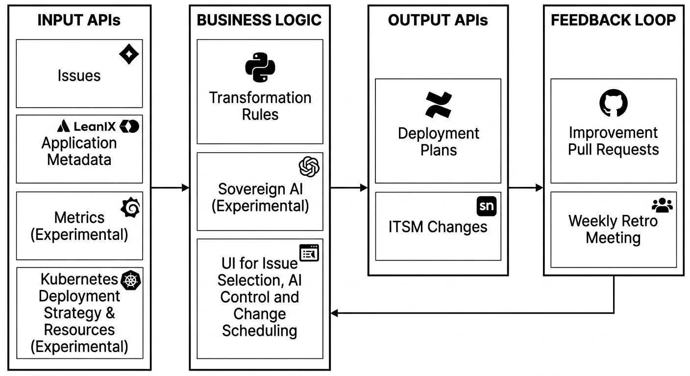

# 🚀 Change Automation Core

  
  
<i>Overview: Bridge between agile development and strict financial regulations.</i>

*Note: This repository serves as a conceptual showcase and architectural documentation of a project I led/developed during my professional tenure. Proprietary source code from my professional tenure is not included.*

## ⚡ Executive Summary
"Change Automation" is a Python-based orchestration tool designed to automate the generation of mandatory deployment plans, effectively bridging the gap between agile development methodologies (IT Kanban) and IT service management governed by strict financial regulations (ITIL and DORA). Each deployment plan alternates between Kanban and ITIL activities, proving that compliance does not have to be a bottleneck for delivery speed.

### 🏆 Impact & Recognition
| Award | Description |
| ----- |-------------|
|   | In 2024, this project won the **DevOps Challenge in the Category "Delivery Velocity"** for a leading European Financial Institution. I developed this as a single developer within a squad. It was recognized for transforming a manual, high-friction compliance process into a high-speed, automated workflow that significantly reduced time-to-production. Since then it successfully orchestrated **hundreds of Change Requests** in live environments, also handling complex multi-issue scenarios (up to 7 Issues per Change). |

### ⚖️ Regulatory Impact
By automating the "Change" process, the tool ensures:
- **Compliance-as-Code:** Direct implementation of requirements from the [Digital Operational Resilience Act (DORA)](https://www.eiopa.europa.eu/digital-operational-resilience-act-dora_en) and VAIT.
- **Process Consistency:** 100% adherence to GitOps and internal Kanban standards.
- **Efficiency:** 80% reduction in manual documentation overhead for production deployments, up to 100% for low-level changes, e.g. Life Cycle Management.

## 🛠️ Key Features & Engineering Design
*   **Multi-Source Integration:** Orchestrates metadata from **agile Project Management, Application Metadata, Application Metrics and Kubernetes** to build a single source of truth for every Change.
*   **Compliance-as-Code:** Automatically generates individual deployment plans with To-Do lists clustered around each activity in IT Kanban and IT Service Management (ITSM) workflows.
*   **GitOps-Driven Improvement Loop:** Every deployment plan activity includes deep-links to the Git-based source in "Edit Mode". This empowers teams to propose immediate improvements via Pull Requests. A new manual hint can be added in seconds to keep everything up-to-date and the hints can often later be coded.
*   **The "Human-in-the-Loop" Quality Gate:** Features a structured weekly review cycle where improvement Pull Requests are merged, ensuring the automation logic evolves through collective intelligence.

## 🛠️ Enterprise Integrations
The tool orchestrates from various API sources:
- **agile Project Management Tool**, e.g. Atlassian Jira: Fetching Jira Issues with their IT Kanban states, X-Ray Tests and deployment-related comments, ensuring alignment with agile Project Management.
- **Application Metadata Tool**, e.g. LeanIX: Fetching architectural context and application metadata.
- **Metrics Tool**, e.g. Grafana: Fetching utilization per hour of the day of the application to change. This integration is experimental and only used occasionally in a controlled environment.
- **Kubernetes:** Fetching Deployment Strategy and Resources to predict the resiliency of the application to change. This integration is experimental and only used occasionally in a controlled environment.
- **Sovereign AI**, e.g. compatible to OpenAI: Creates a drafting "reason for change" by a general prompt and the titles of all Jira issues which are part of the change. The Jira issues do not contain personal or secret data, this is especially ensured by IT-Kanban definiton of done. The AI-generated "reason for change" is treated strictly as a non-binding draft. It is presented exclusively on the local/personal device for mandatory human review and manual approval before being used as input for the ServiceNow change process. This ensures full human oversight and prevents automated propagation of AI-generated content into production systems.
- **IT Service Management Tool**, e.g. ServiceNow: Creation of Changes, ensuring alignment with IT Service Management (ITSM).
- **Knowledge Management System**, e.g. Atlassian Confluence: Creation of individual deployment plans.

---

## 🌟 Support Open Innovation & Visibility

If you found this architectural showcase valuable for your DevOps or Compliance journey, please give it a **⭐️ Star**. It directly supports the sharing of award-winning patterns like **"Compliance-as-Code"** with the broader community.

  

[**Follow Me on LinkedIn**](https://www.linkedin.com/in/karl-josef-hilger-b7209b3b4/)

---

## 📄 License

This project is licensed under the MIT License - see the [LICENSE](LICENSE) file for details.
